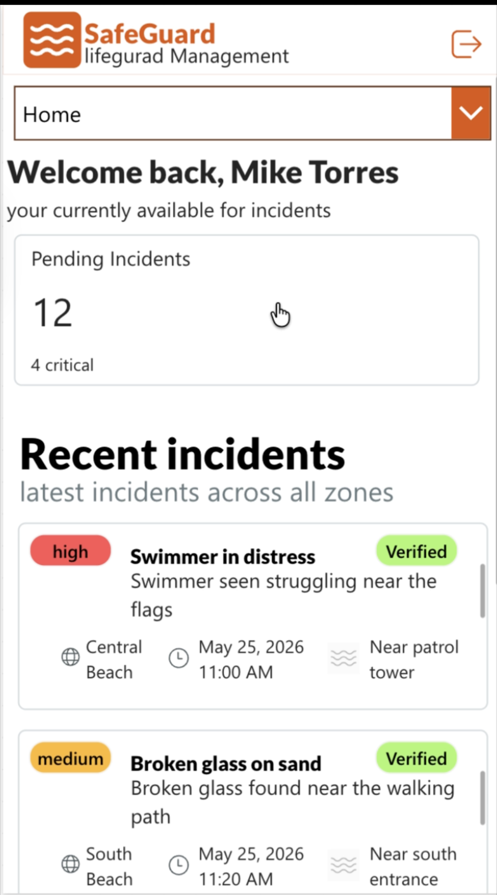

# SurfGuard Power Apps MVP

SurfGuard is a Power Apps prototype for helping lifeguard teams log incidents, verify reports, and manage equipment checks.

## Why This Project Exists

SurfGuard was created for the ELEC1005 Assignment 2 MVP to support beach patrol operations.

It solves the problem of patrol information being spread across manual notes, separate reports, and informal communication. The app gives volunteers, patrol captains, and club admins a shared system for recording and updating key patrol information.

## Who It Is For

- **Volunteers** who need to report incidents quickly
- **Patrol Captains** who need to review incidents and manage equipment checks
- **Club Admins** who need visibility over equipment and operational records

## Key Features

- Create new incident reports
- Save incident records to a SharePoint `Incidents` list
- Assign incident status such as `pending`, `verified`, or `rejected`
- Record reviewer name and verification time
- View recent incidents in the app
- View equipment records from a SharePoint `Equipment` list
- Update equipment status as `OK`, `Repair`, or `Missing`
- Record who checked equipment and when it was checked
- Role-based navigation for Volunteer, Patrol Captain, and Club Admin workflows

## Quick Start

1. Open the shared Power Apps link.
2. Select a role from the role selection screen:
   - Volunteer
   - Patrol Captain
   - Club Admin
3. To create an incident:
   - Select Volunteer or Patrol Captain
   - Open **Create Incident**
   - Fill in all required fields
   - Submit the form
   - Confirm the new incident appears in the incident list
4. To verify an incident:
   - Select Patrol Captain
   - Open a pending incident
   - Enter the reviewer name
   - Select a verification status
   - Submit the review
5. To log equipment maintenance:
   - Select Patrol Captain
   - Open **Equipment Management**
   - Confirm or edit the `CheckedBy` field
   - Select `OK`, `Repair`, or `Missing`
   - Confirm the equipment card and SharePoint list update

## Common Confusion

### “Why does the login not use real authentication?”

Authentication is mocked in this MVP. The role selection screen is used to demonstrate role-specific workflows for Volunteers, Patrol Captains, and Club Admins. Full authentication was outside the Assignment 2 prototype scope.

### “Why are some pages placeholders?”

Some screens are included for navigation continuity and future expansion. The implemented MVP focuses on the required use cases: incident logging, incident verification, and equipment maintenance.

### “Why did some automated tests not fully run in Power Apps Test Studio?”

Power Apps Test Studio had limitations with controls inside galleries and some modern components. Workflows affected by these limitations were manually tested and verified using live app behaviour and SharePoint list updates.

### “Why is the repository name unrelated?”

This repository was reused for the SurfGuard Assignment 2 Power App source submission due to access issues with the original group repository. The repository contains the exported Power App file and manually extracted source folder.

### “Why is the source folder manually extracted?”

Multiple attempts were made to unpack the `.msapp` file using Microsoft Power Platform CLI, but the CLI failed with a non-recoverable `System.NullReferenceException`. As a workaround, the `.msapp` file was manually extracted as a zip archive.

## Repository Structure

- `SurfGuard.msapp` — exported Power Apps canvas application package
- `SurfGuardManualUnpack/` — manually extracted contents of the `.msapp` package
- `SurfGuardManualUnpack/Src/` — Power Apps screen/source YAML files
- `SurfGuardManualUnpack/Controls/` — control metadata JSON files
- `SurfGuardManualUnpack/References/` — data source, theme, and resource references
- `SurfGuardManualUnpack/AppTests/` — exported app test files
- `SurfGuardManualUnpack/Assets/` — images and other app assets

## Notes on Source Extraction

Multiple attempts were made to unpack the `.msapp` file using Microsoft Power Platform CLI, including running the command from both VS Code and the macOS Terminal, refreshing the CLI path, and retrying the unpack process from different working directories.

The intended Microsoft Power Platform CLI command was:

`pac canvas unpack --msapp "./SurfGuard.msapp" --sources "./SurfGuardSource"`

However, each attempt failed with a non-recoverable `System.NullReferenceException`.

As a workaround, the `.msapp` file was manually extracted as a zip archive, which successfully produced the app source structure, including Power Apps YAML screen definitions, control metadata, references, tests, and assets.

This repository therefore includes both the original `.msapp` file and the manually extracted source contents.

## Testing

Testing was completed using a combination of Power Apps Test Studio and manual verification.

The main workflows tested were:

- UC01: Log an Incident
- UC02: Verify an Incident Report
- UC03: Log Equipment Maintenance

Some workflows were manually verified because Power Apps Test Studio could not reliably interact with controls nested inside galleries or some modern controls.

## One Optional Visual

Screenshot of the patrol captain landing page:

